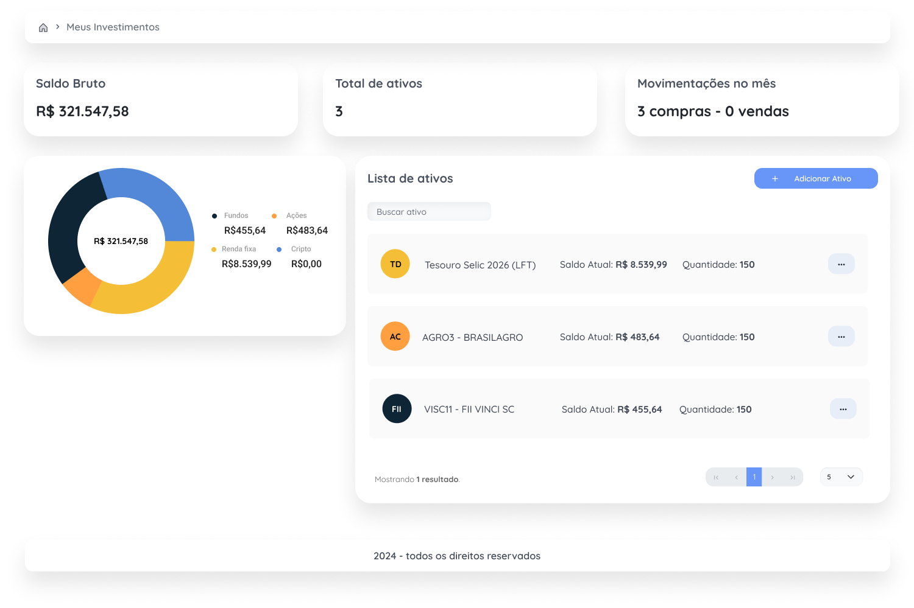

<h1 align="center">Welcome to Web Investment Wallet 👋</h1>

<p>
  
  <a href="#" target="_blank">
    
  </a>
</p>

> Api for tracking a client’s investment portfolio.

## Preview

<p align="center">
  
</p>

## Requirements

- Node v18.0.0 or higher

## Install

```sh
yarn install
```

## Environment variables

Configuration variables for the API.

```sh
cp .env.example .env.local
```

## Usage

```sh
yarn dev
```

## Author

👤 **Richard Neves**

- Website: <https://richard-neves.vercel.app/>
- Github: [@rickneves15](https://github.com/rickneves15)
